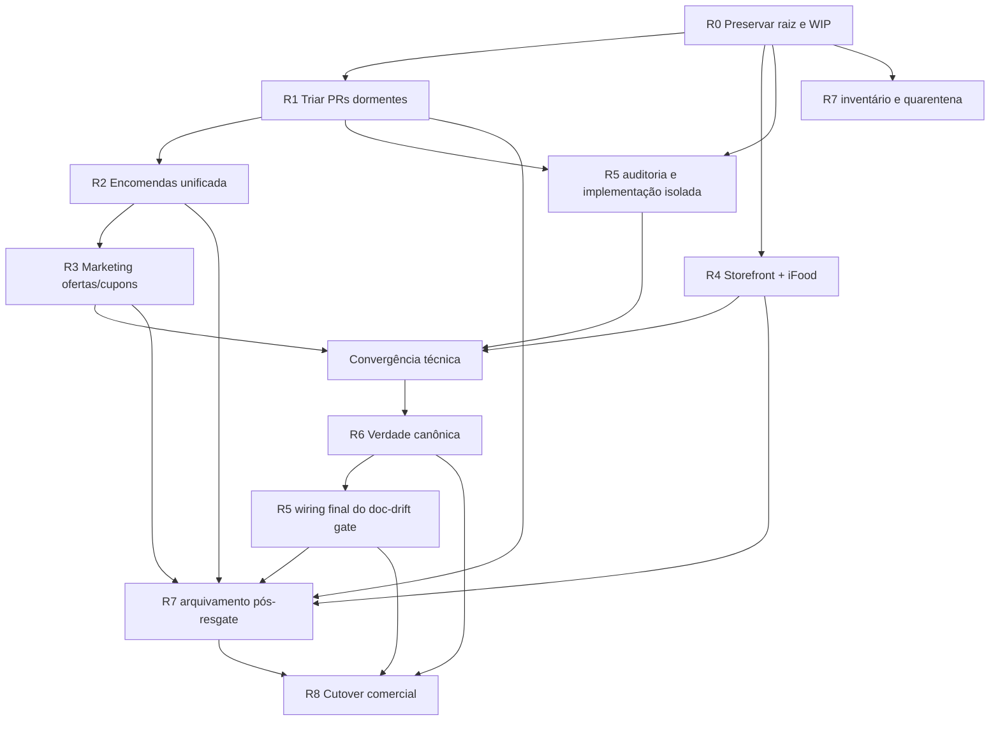

# Programa de execução — Recuperação e Go-live

- **Data-base:** 2026-09-28
- **Status:** pronto para lançamento coordenado; nenhuma onda de execução é autorizada implicitamente por este documento
- **Branch documental:** `codex/go-live-recovery-program-20260928`
- **Objetivo:** transformar nove WPs independentes em uma sequência única, paralelizável onde seguro e serial onde arquivos ou decisões se cruzam
- **Regra central:** uma frente, uma branch, um PR e um owner; um arquivo disputado, um único integrador

## 1. Resultado do programa

O programa termina quando o repositório, o produto e a operação formam uma única linha verificável até o Go-live:

1. nenhum trabalho crítico existe somente em working tree local;
2. checkout raiz e worktrees deixam de ser fonte de conflito ou perda;
3. PRs dormentes recebem destino factual;
4. Encomendas, Marketing e Storefront são integrados sem duas fontes de verdade;
5. segurança, dependências e gates de release tornam falhas visíveis e bloqueantes;
6. documentação canônica descreve o sistema realmente implantado;
7. o corte comercial acontece somente após gates técnicos, físicos, financeiros e humanos.

Este índice não substitui os WPs. Ele governa dependências, leases, ondas, evidência e Definition of Done global. Em conflito, a regra mais restritiva prevalece; uma contradição de produto ou ambiente vira gate humano.

## 2. Inventário dos nove WPs

| ID | WP | Resultado principal | Natureza |
|---|---|---|---|
| R0 | [Recuperação da raiz e WIP crítico](WP-GO-LIVE-RECOVERY-ROOT-AND-CRITICAL-WIP-2026-09-28.md) | snapshots de Marketing e duas frentes de Encomendas; raiz sem cherry-pick; checkout canônico limpo | preservação e infraestrutura Git |
| R1 | [Triagem de PRs dormentes](WP-DORMANT-PR-TRIAGE-2026-09-28.md) | destino de #722, #1148, #1116, #1119 e #1120; leases centrais liberados | coordenação e resgate |
| R2 | [Integração única de Encomendas](WP-ENCOMENDAS-UNIFIED-INTEGRATION-2026-09-28.md) | tela única e detalhe compartilhado, com um contrato canônico | implementação P0 |
| R3 | [Resgate de ofertas e cupons](WP-MARKETING-OFFERS-COUPONS-RESCUE-2026-09-28.md) | API/UI de ofertas e cupons e migration linear | implementação P1 |
| R4 | [Foco do Storefront e aprendizados iFood](WP-STOREFRONT-FOCUS-AND-IFOOD-LEARNINGS-INTEGRATION-2026-09-28.md) | código de foco recuperado e benchmark/WPs de endereço consolidados | implementação e documentação UX |
| R5 | [Segurança, supply chain e CI](WP-DELIVERY-SECURITY-AND-CI-CLOSURE-2026-09-28.md) | dependências corrigidas; SAST, cobertura e contratos de release verificáveis | plataforma de entrega |
| R6 | [Verdade canônica de Go-live](WP-CANONICAL-GO-LIVE-TRUTH-2026-09-28.md) | uma matriz operacional coerente e trava de drift | documentação operacional |
| R7 | [Higiene de worktrees e branches](WP-REPOSITORY-WORKTREE-BRANCH-HYGIENE-2026-09-28.md) | worktrees, locks, branches e temporários classificados e reduzidos com recuperação | higiene Git |
| R8 | [Cutover comercial](WP-COMMERCIAL-GO-LIVE-CUTOVER-2026-09-28.md) | canário financeiro/fiscal, decisão GO/NO-GO e expansão controlada | operação viva |

## 3. Baseline do programa

O inventário inicial registrou:

- checkout raiz preso desde 15/09 em cherry-pick já equivalente ao `main`, com dois conflitos;
- três working trees grandes sem commit e dois deles disputando sete arquivos de Encomendas;
- 55 worktrees: 39 limpas, 16 sujas, 6 detached e 6 locked;
- 36 worktrees limpas e ancestrais do `main`, candidatas a arquivamento depois da checagem de sessão;
- 853 branches locais, 651 remotas e 223 locais sem upstream;
- 747 heads ancestrais do `main`, 38 branches apenas com patches equivalentes e 68 com algum patch único;
- PRs dormentes/conflitantes e dez PRs Dependabot abertos;
- documentação de Go-live contraditória sobre deploy, versão, ambiente e capacidades;
- lacunas conhecidas em SAST, cobertura bloqueante e contrato de produção no CI.

Todo número deve ser recapturado no início da execução. A data-base não é uma promessa de estado atual.

## 4. Dependency DAG



### Leitura normativa do DAG

- R0 bloqueia toda mutação sobre as três worktrees críticas e sobre o checkout raiz.
- R1 precisa liberar `operations.py`, `urls.py`, ticket, POS index e contratos antes de R2.
- R2 precede R3 para que `shopman/backstage/api/urls.py` tenha uma única sequência de integração.
- R4 pode avançar em paralelo a R1/R2/R3 porque possui lease exclusivo de Storefront e documentos dedicados.
- R5 pode auditar e implementar áreas isoladas em paralelo, mas alterações de manifests do `operator-kit` esperam o destino de #722.
- R6 coleta evidência cedo, porém só publica a verdade canônica depois da convergência técnica.
- R5 permanece aberto até conectar ao CI a trava de drift entregue por R6.
- R7 pode inventariar e colocar branches em quarentena desde R0; só arquiva fontes quando o WP consumidor tiver merge e smoke.
- R8 é terminal. Nenhum atalho técnico substitui seus gates humanos.

## 5. Ondas executáveis

### Onda 0 — controle e freeze

- **Executa:** coordenador do programa.
- **Entregas:** baseline recapturado, owners nomeados, freeze das três worktrees críticas, registro inicial de leases e diretório externo de evidência.

Passos:

1. verificar `main` remoto, worktrees, PRs e sessões vivas;
2. atribuir owner único a R0–R8;
3. congelar Marketing e as duas doadoras de Encomendas;
4. registrar todos os leases desta versão;
5. publicar status inicial, sem iniciar limpeza.

**Gate W0:** nenhum caminho crítico continua recebendo escrita não coordenada.

### Onda 1 — preservação e chão limpo

- **Executa:** R0, de forma serial.
- **Entregas:** três snapshots remotos/drafts, patches com hash, cherry-pick raiz provado redundante, raiz sem operação interrompida e checkout canônico de `main`.

R7 pode apenas coletar inventário. R5 e R6 podem fazer leitura, sem publicar mudanças que disputem leases.

**Gate W1:** snapshots recuperados em segundo checkout; checkout canônico limpo; nenhum arquivo crítico existe só localmente.

### Onda 2 — desbloqueio de PRs e frentes ortogonais

Três lanes podem rodar em paralelo:

| Lane | Trabalho | Condição |
|---|---|---|
| 2A | R1 completo: #722, #1148, #1116, #1119, #1120 | um coordenador exclusivo dos cinco PRs |
| 2B | R4: foco do Storefront e documentação iFood/endereço | sem implementação de mapa; lease Storefront exclusivo |
| 2C | R5: dependências fora do lease #722, SAST, cobertura e contrato | não alterar manifests do `operator-kit` antes de #722 |

R7 mantém quarentena e pode arquivar somente worktrees limpas, integradas, sem sessão e sem dependência de R1–R5.

**Gate W2:** leases de R1 liberados; #1116 fechado por equivalência ou delta factual registrado; #1119 e #1120 têm destino; #722 não disputa mais manifests.

### Onda 3 — Encomendas, integrador único

- **Executa:** R2.
- **Entregas:** composição semântica das duas doadoras, contrato regenerado, tela única, detalhe compartilhado, redirects e staging smoke.

Nenhuma outra frente edita os arquivos listados no lease R2. Marketing pode preparar arquivos exclusivos, mas não integrar `api/urls.py`.

**Gate W3:** CI completo e smoke autenticado em staging; matriz “fonte A/fonte B/decisão” revisada; leases liberados.

### Onda 4 — Marketing

- **Executa:** R3.
- **Entregas:** migration renumerada sobre o leaf real, API/UI transacionais, pricing preservado e staging smoke.

O lease curto de `api/urls.py` só é adquirido depois de R2. O número `0083` local nunca é reaproveitado cegamente.

**Gate W4:** grafo linear, CI verde, nenhum `node_modules`, oferta/cupom de smoke controlados e lease liberado.

### Onda 5 — convergência técnica e documental

**Executa:** conclusão de R4 e R5, seguida por R6 e wiring final de R5.

Ordem:

1. integrar todos os WPs de código aceitos no escopo v1;
2. executar CI no HEAD convergido;
3. R6 produzir matriz canônica com fontes datadas;
4. R5 conectar o verificador de drift ao gate bloqueante;
5. rodar novamente gates técnicos e de documentação.

**Gate W5:** nenhum documento descreve um estado anterior ao HEAD; Security, Coverage, Production e Operator Groups Contracts têm nomes estáveis e evidência atual.

### Onda 6 — higiene final não destrutiva

**Executa:** R7.

- arquivar worktrees-fonte somente após merge e smoke do consumidor;
- resolver locks órfãos por mecanismo suportado;
- classificar temporários;
- manter branches com patch único;
- colocar candidatas a remoção em quarentena de sete dias.

A espera da quarentena não bloqueia o Go-live se nenhuma branch/worktree crítica estiver invisível, suja ou sem owner. Remoção definitiva de branches é follow-up humano e não requisito do cutover.

**Gate W6:** `make inflight` não mostra trabalho crítico sem dono/PR; remanescentes têm classe, owner e próximo evento.

### Onda 7 — cutover comercial

**Executa:** R8 sob comando humano.

Inclui auditoria somente leitura, staging rehearsal, credenciais pelo owner, QA físico/mobile, freeze, backup, tag autorizada, canários Pix/cartão/NFC-e, estornos, reconciliação e decisão GO/NO-GO.

**Gate W7:** decisão humana assinada. Sem autorização ou evidência, estado final é `BLOCKED — HUMAN GATE`, nunca sucesso presumido.

## 6. Leases de arquivos e superfícies

### 6.1 Registro obrigatório

Cada lease contém:

```text
lease_id | paths exatos | owner | branch | PR | adquirido_em | revisar_em | estado | evidência_de_liberação
```

Estados permitidos: `REQUESTED`, `ACTIVE`, `HANDOFF`, `RELEASED`, `BLOCKED`.

Um path só pode ter um lease `ACTIVE` de escrita. Leitura não concede direito de editar. Worktrees doadoras ficam `READ_ONLY` desde W0.

### 6.2 Matriz inicial

| Lease | Paths/superfície | Ordem de posse |
|---|---|---|
| L-GIT-ROOT | checkout raiz, refs/worktrees durante preservação | R0 → R7 |
| L-PR-OPS | `shopman/backstage/api/operations.py` | R1 (#1119/#1120) → R2 |
| L-PR-URLS | `shopman/backstage/api/urls.py` | R1 (#1116/#1119) → R2 → R3 |
| L-ORDER-CONTRACT | exportador, contrato gerado, projeções e testes de pedido | R1 → R2 |
| L-ORDER-TICKET | `order_ticket.py`, testes, POS index, schema de dados | R1 (#1120) → R2 |
| L-ENCOMENDAS | sete arquivos sobrepostos e consumidores POS/Orders | somente R2 |
| L-MARKETING | API Marketing, modelos/serviços de campanha e `marketing-nuxt` | somente R3 |
| L-MIGRATION-SHOP | próximo leaf de `shopman/shop/migrations` | R3 durante geração/rebase final |
| L-STOREFRONT-FOCUS | `tailwind.css`, `LegalDocument`, `useNextFocus`, `entrar.vue`, `finalizar.vue` e testes | somente R4 |
| L-OPERATOR-KIT-MANIFEST | manifests/lockfiles do `operator-kit` | R1 (#722) → R5 |
| L-SUPPLY-CHAIN | lockfiles e workflows de segurança/cobertura/contrato | R5, respeitando leases por surface |
| L-CANONICAL-DOCS | status, readiness, credentials, runbooks, runtime/deploy docs | somente R6 |
| L-CUTOVER | ambiente vivo, tag, flags, provedores e evidência comercial | R8 após autorização pontual |

### 6.3 Handoff

Um lease só muda de owner quando:

1. o owner anterior para de escrever;
2. branch/PR está publicado ou snapshot remoto existe;
3. status do path está limpo ou o diff pendente está explicitamente transferido;
4. testes/gates conhecidos são registrados;
5. o próximo owner confirma o SHA-base;
6. o coordenador marca `RELEASED` e depois `ACTIVE` para o sucessor.

Não existe handoff implícito por silêncio, lock morto ou PR parado.

## 7. Política de um integrador por conflito

1. O integrador é nomeado por conjunto de paths, não por “tema” genérico.
2. Branches doadoras são evidência; não recebem rebase, cleanup ou resolução.
3. O integrador começa de `origin/main` atualizado em worktree limpa.
4. Cada hunk recebe decisão semântica rastreável: fonte A, fonte B, combinação ou descarte justificado.
5. É proibido resolver arquivo inteiro com `ours`/`theirs` quando ambas as fontes têm intenção útil.
6. Contratos gerados são regenerados a partir da fonte; nunca copiados cegamente.
7. Migration recebe número/dependência do leaf observado no rebase final.
8. Se um novo merge tocar path leased, o integrador pausa, atualiza a matriz e só então continua.
9. Revisão independente é obrigatória para os sete arquivos de Encomendas e para `api/urls.py`.
10. O lease termina apenas após merge e smoke, não após “código pronto”.

## 8. Gates humanos inevitáveis

| Gate | Decisão humana | Quem prepara evidência | Regra de parada |
|---|---|---|---|
| H0 | autorizar saneamento da raiz depois dos snapshots | R0 | sem três snapshots recuperáveis, não abortar/alterar raiz |
| H1 | aprovar ou rejeitar redesign visual de impressão do #1120 | R1 | DANFE funcional pode ser separada; visual não mergeia |
| H2 | habilitar Code Security/CodeQL, push protection e alterar branch protection | R5 | workflow/proposta podem existir; settings não mudam |
| H3 | confirmar fases oficiais, domínio comercial e escopo v1 | R6 | documento usa `DESCONHECIDO` e não inventa verdade |
| H4 | aprovar matriz de remoção de branches após quarentena | R7 | arquivamento recuperável pode avançar; branch não é apagada |
| H5 | inserir/rotacionar credenciais, mudar spec/ingress/DNS ou ativar 2FA global | R8 | parar antes da mutação externa |
| H6 | criar tag, ligar Go-live e disparar deploy de produção | R8 | SHA permanece candidato, sem publicação |
| H7 | pagar, emitir/cancelar NFC-e, estornar, enviar mensagem ou abrir corrida | R8 | executor observa; humano executa ação autorizada |
| H8 | decisão final GO/NO-GO e expansão além do canário | incident commander/owner | ausência de assinatura é `BLOCKED — HUMAN GATE` |

Autorizações são pontuais: devem nomear alvo, ambiente, impacto e rollback. Uma autorização não se propaga para a ação seguinte.

## 9. Protocolo de evidência

### 9.1 Envelope mínimo

Toda evidência registra:

- WP, fase, gate e owner;
- timestamp UTC e timezone de apresentação;
- repositório/worktree, branch e SHA;
- comando ou ação reproduzível;
- ambiente (`local`, `CI`, `staging`, `production`);
- resultado bruto ou link imutável;
- redactions aplicadas;
- interpretação separada do fato;
- próximo evento.

### 9.2 Armazenamento

- outputs grandes, patches de recuperação e logs brutos: storage temporário/controlado, com SHA-256 e manifest;
- evidência de CI/deploy: URL/ID do run e SHA, não cópia parcial do log;
- resumo permanente e sanitizado: PR ou report versionado;
- screenshots: sem PII, tokens, endereço residencial, código Pix ou identificador de pedido;
- secrets: nunca em chat, commit, artifact ou screenshot.

Arquivo temporário usa nome único por WP/PR. É proibido compartilhar `pr.md`, `msg.txt` ou nomes genéricos entre sessões.

### 9.3 Validade

Evidência perde validade quando muda:

- SHA relevante;
- base do PR;
- migration leaf;
- lockfile;
- configuração do ambiente;
- provider/credencial;
- aparelho/browser exigido;
- data-limite declarada pelo gate.

Check verde anterior a rebase não vale para o novo HEAD.

## 10. Protocolo de status

Estados globais:

- `NOT_STARTED`;
- `ACTIVE`;
- `BLOCKED_TECH`;
- `BLOCKED_HUMAN`;
- `READY_FOR_REVIEW`;
- `IN_QUEUE`;
- `MERGED`;
- `VERIFIED_STAGING`;
- `DONE`;
- `SUPERSEDED`.

Cada atualização material deve conter:

```text
WP/onda:
estado:
owner:
branch/PR/SHA:
lease(s):
última evidência:
bloqueio ou risco:
próximo evento:
decisão humana necessária:
```

Atualizar em transição de estado, falha, handoff, mudança de SHA ou gate humano. Não gerar ruído periódico se nada mudou.

Condições proibidas ao encerrar uma sessão:

- mudança útil apenas local;
- branch sem upstream/PR e sem snapshot;
- PR verde fora de fila sem justificativa;
- bloqueio sem owner/próximo evento;
- lease ativo sem sessão sucessora ou release explícito.

## 11. Correções de consistência aplicadas nesta consolidação

1. `#1116` não será reconstruído por padrão: seu único patch aparece como equivalente ao `main`. R1 deve provar novamente e fechá-lo como supersedido; qualquer delta real vira exceção factual.
2. `#1119` parte do backend canônico do `main` e reaplica somente quatro commits adicionais de UI.
3. R3 integra depois de R2, eliminando ambiguidade sobre a ordem de `shopman/backstage/api/urls.py`.
4. R5 aguarda #722 para manifests do `operator-kit` e volta após R6 para ligar o doc-drift gate.
5. O cutover exige checkout canônico limpo e raiz sem operação/conflito; untracked classificados na raiz não são confundidos com código pronto para integração.
6. Quarentena de sete dias para remoção de branches não bloqueia o cutover; trabalho crítico invisível ou sem owner bloqueia.

## 12. Definition of Done global

### Repositório e preservação

- [ ] três working trees críticos possuem snapshots remotos verificados e destino final;
- [ ] checkout raiz não possui cherry-pick/merge/rebase em andamento nem conflitos;
- [ ] checkout canônico de `main` está limpo e coincide com o remoto;
- [ ] nenhuma mudança útil existe apenas em disco;
- [ ] todos os leases foram liberados;
- [ ] `make inflight` não apresenta trabalho crítico sem owner, branch e PR;
- [ ] worktrees/locks/temporários remanescentes têm classe, owner e próximo evento;
- [ ] branches únicas permanecem recuperáveis; nenhuma remoção ocorreu sem matriz aprovada.

### Produto integrado

- [ ] PRs dormentes receberam destino explícito e rastreável;
- [ ] Encomendas possui uma entrada, um detalhe compartilhado e um contrato canônico;
- [ ] Marketing possui migration linear, API/UI transacionais e regras de preço preservadas;
- [ ] foco do Storefront foi reconciliado e testado em SPA/reload/mobile;
- [ ] benchmark iFood e WPs de endereço estão atualizados, sanitizados e sem declarar cobertura mobile inexistente;
- [ ] nenhuma implementação de mapa/geolocalização entrou sem aprovação própria.

### Entrega e verdade operacional

- [ ] alertas de dependência conhecidos foram corrigidos ou aceitos com owner/prazo;
- [ ] CodeQL produz análise, cobertura combinada respeita 75% e contratos bloqueantes passam;
- [ ] CI sintética não chama provedores reais;
- [ ] documentação canônica não contradiz código, workflows, ambiente ou escopo;
- [ ] todo bloqueio documental tem owner, evidência e próximo evento;
- [ ] zero P0 aberto no SHA candidato;
- [ ] full CI e smoke de staging estão verdes no mesmo SHA.

### Operação comercial

- [ ] restore e rollback foram ensaiados;
- [ ] QA físico e mobile foi realizado em aparelho/estação real;
- [ ] credenciais e hardening foram confirmados sem expor secrets;
- [ ] canários Pix e cartão, NFC-e e estornos foram executados por humano e reconciliados;
- [ ] observabilidade, workers, filas e alertas foram comprovados;
- [ ] tag e deployment foram explicitamente autorizados;
- [ ] decisão final GO foi assinada pelo owner/incident commander;
- [ ] expansão além do canário respeita nova janela de decisão.

Se qualquer item terminal não puder ser provado, o programa não está concluído. O estado correto é `BLOCKED_TECH`, `BLOCKED_HUMAN` ou `NO-GO`, acompanhado do próximo evento.

## 13. Ordem resumida de execução

```text
W0 freeze e leases
→ R0 preservar/sanear/criar main canônico
→ em paralelo: R1 triagem | R4 Storefront/docs | R5 segurança isolada | R7 inventário
→ R2 Encomendas
→ R3 Marketing
→ convergir R4/R5 e full CI
→ R6 verdade canônica
→ R5 wiring final do doc-drift gate
→ R7 arquivamento e quarentena
→ R8 cutover comercial e decisão GO/NO-GO
```

Essa ordem é normativa para paths compartilhados. Paralelismo fora deles continua permitido sob lease explícito.
